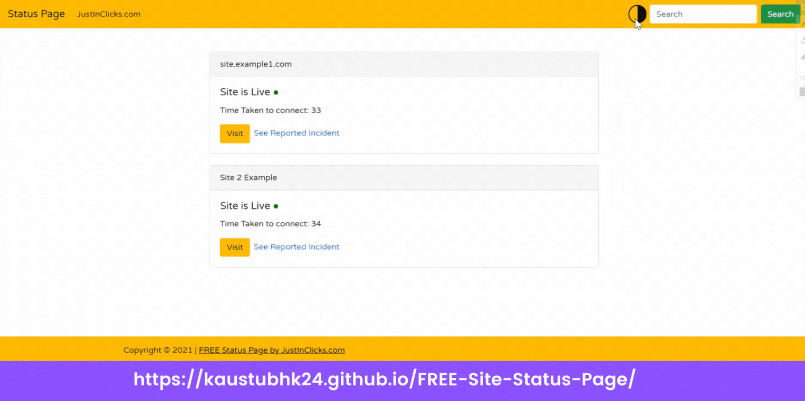
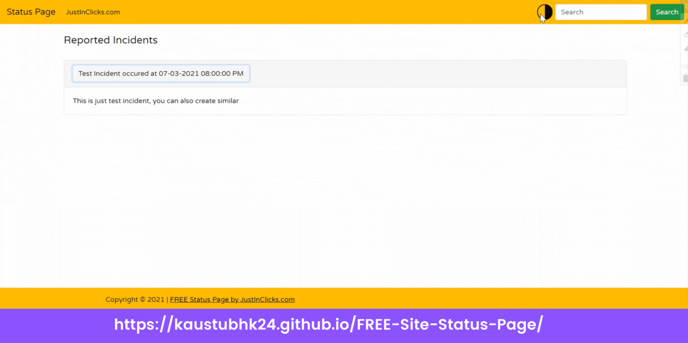

# FREE Site Status Page
Are you looking for status page for your site/sites? Many times we need to check if our site is working properly or not, So I developed this tool, You can easily host it on GitHub Pages and by just making few changes you can create status page for your website & as it is hosted on GitHub pages, it is completely free to use. You can check Example here [Status Page JustInClicks.com](https://status.justinclicks.com) </br>
See [Live App Preview](https://kaustubhk24.github.io/FREE-Site-Status-Page/)

## How to Create Status Page for your site?   
* To create status Page first fork [this](https://github.com/kaustubhk24/FREE-Site-Status-Page) repository.
* Go to repository setting and turn on GitHub pages option.
* In Next Step open file named `CNAME` & remove text `status.justinclicks.com` and enter your custom URL. e.g. `status.example.com`
* From repo settings enable tick on `SSL` & update records respectively in your domain `DNS settings`.
* Last step is to open `main.js` & you will see code below, you just need to add your sites there.
```
sites=[
    {
        'site_name':'Example.com',
        'site_url':'https://www.example.com/'
    },
    
    {
        'site_name':'Sub Example',
        'site_url':'https://sub-domain.example.com/'
    }
]
```    

* Now at the place of `site_name` you have to enter your site Title & in `site_url` enter exact URL of your site with `http or https` properly.
* Make sure you haven't kept any previous site name, just remove all of them & add yours
* Now create file in `incidents/` folder with site name for example if your site name is `Example Site` in `main.js` then your file name will be `Example Site.json`, Do not remove spaces or anything , use exact site name from `main.js` & keep file in `incidents/` folder .
* To report incident open your site file from `incidents/` folder, & copy content below there
```
[
    {
        "incident_name":"incident_name at time",
        "description":"description"
    },
    {
        "incident_name":"incident_name 2 at time",
        "description":"description 2"
    }
]

```
* Make changes according to your requirements, that's it
* Done ! Once GitHub Build pages your site status page will be Live.

## Issues 
* See Known [Issues here](https://github.com/kaustubhk24/FREE-Site-Status-Page/issues)
* Create New [Issue here](https://github.com/kaustubhk24/FREE-Site-Status-Page/issues/new)

## Screenshots


|   |   |
|---|---|
|   |   |


## Disclaimer
We have tried our best to keep the code bug free, users are requested to confirm information with their sites before using the information provided. The author reserves the right not to be responsible for the topicality, correctness, completeness or quality of the information provided. Liability claims regarding damage caused by the use of any information provided, including any kind of information which is incomplete or incorrect, will therefore be rejected.

## Licensing
You are free to download / modify / sell code but with terms below but not limited to,
* You should not remove footer credits and links
* You can not add your footer credits
* You should remove `JustInClicks` links from `main.js` files, you should keep only your links
* All use and/or publication rights are reserved worldwide.
* Copyrights &copy; 2021 Kaustubh Kulkarni { [Kaustubhk24](https://github.com/kaustubhk24/) }
